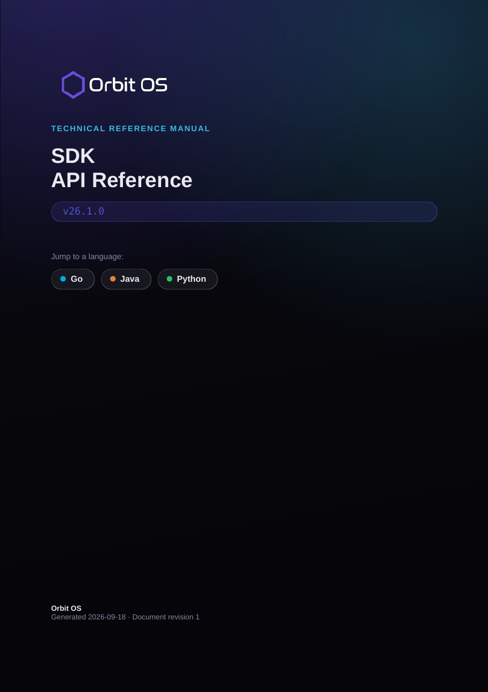

# Orbit OS Documentation

Downloadable documentation for [Orbit OS](https://www.orbit-os.org), the embedded Linux platform.

## SDK API Reference (PDF)

The full reference for all services, permissions and device APIs in the Orbit OS SDK, as a printable manual. Each manual covers Go, Java and Python.

  

| API | Released | Status | SDK versions | Manual (PDF) |
|---|---|---|---|---|
| 26.1 | September 2026 | **Recommended** | 26.1.0 | [Orbit_OS_SDK_API_Reference_v26.1.0.pdf](https://www.orbit-os.org/pdfs/Orbit_OS_SDK_API_Reference_v26.1.0.pdf) |
| 26.0 | May 2026 | Old | 26.0.1, 26.0.2, 26.0.3 | [Orbit_OS_SDK_API_Reference_v26.0.1.pdf](https://www.orbit-os.org/pdfs/Orbit_OS_SDK_API_Reference_v26.0.1.pdf) |

The first two numbers are the API version; the third is the SDK revision for that API. SDK revisions only fix the SDK wrappers, so one manual covers every SDK version of the same API.

### What's new in API 26.1

- **Push notifications** — apps can send push notifications straight to a user's phone through the new `MobileNotificationService` (`MobileNotificationManager` in the SDK). They are delivered to the Orbit OS mobile app, and users enable delivery per device in Settings → Notifications.
- **Device certification** — apps can check at runtime whether the hardware is certified for Orbit OS, with `IsDeviceCertified` and `GetSerialNumber`. See the [Hardware Certification Program](https://www.orbit-os.org/certification.html).
- **More reliable accounts** — devices stay connected to accounts more dependably, and sign-ins are faster.

Full details are in the [release notes](https://www.orbit-os.org/releases.html#v26-1).

The same reference is available online at [orbit-os.org/api-reference.html](https://www.orbit-os.org/api-reference.html).

## SDKs

- [orbit-os-sdk-go](https://github.com/OrbitOS-org/orbit-os-sdk-go)
- [orbit-os-sdk-java](https://github.com/OrbitOS-org/orbit-os-sdk-java)
- [orbit-os-sdk-python](https://github.com/OrbitOS-org/orbit-os-sdk-python)

## More

- [Getting started](https://www.orbit-os.org/getting_started.html)
- [Downloads](https://www.orbit-os.org/downloads.html)
